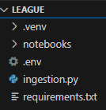

# Extraction Scrip Instructions

## Setup
.env, ingestion.py, requirements.txt must be on the same level of the directory like so:\

## First step:
### Create virtual environment

## Second step:
### Install the dependencies

pip install -r requirements.txt

## Third step:
### Run the script ingestion.py

python ingestion.py

# Chron Details

Every 2 hours